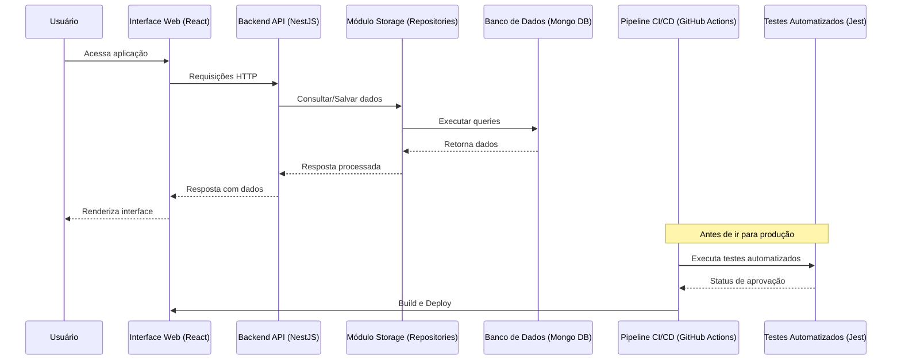

# Project PPS

Projeto para Planejamento, Gerenciamento de Produtos e Controle de Estoque.
A arquitetura do Projeto contém  **NestJS + NodeJS** no backend com banco NoSQL **MongoDB** e **React + Tailwind** no frontend.
<p style="display:flex;gap:30px;justify-content:center">


</p>

## **Arquitetura**
A arquitetura é dividida em dois principais módulos:

###  **Backend**: Desenvolvido com NestJS, responsável por fornecer APIs REST.
- **Swagger Open API**: Disponível via endpoint http://localhost:3000/reference , implementado com biblioteca nativa  *Nest*  e *Scalar* .

###  **Frontend**: Desenvolvido em ReactJS, estilizado com Tailwind.

Além disso:
- **Jest**: Utilizado para testes de unidade no backend.
- **GitHub Actions**: Configurado para rodar testes e verificar o build automaticamente.

###  **Estrutura de Pastas**

```bash
project-pps/
│
├── backend/ # Backend (NestJS)
│ ├── modules/ # Funcionalidades (divididas por domínio)
│ ├── common/ # Helpers e middlewares
│ └── storage/ # Acesso direto ao banco
│
├── frontend/ # Frontend (React + Tailwind)
│ ├── components/ # Componentes reutilizáveis
│ └── pages/ # Páginas
│
└── .github/ # Pipeline CI/CD (GitHub Actions)
```

### **Fluxo Geral**
1. O usuário acessa a interface web (**React**).
2. A interface consome dados via APIs expostas no **NestJS**.
3. O backend acessa o banco através do módulo **Storage** (repositories).
4. Todo código é testado com **Jest** antes de subir para produção.
5. O pipeline (**GitHub Actions**) garante a qualidade e o build do projeto.
<br/>
<br/>


<br/>
<br/>
<br/>

## **Como rodar localmente**

### **Pré-requisitos**
-  NodeJS 18+ 
-  npm ou yarn 
-  (Opcional) Docker 

### **Passos**
```bash
# Clonar o repositório
git clone https://github.com/augukelsch/project-pps-v00.git
cd project-pps

# Backend
cd backend
npm install
npm run start:dev

# Frontend
cd ../frontend
npm install
npm run dev

# Tests
cd backend
npm run test

```

### **Estrutura Final Proposta**

```bash
my-project/
│
├── .github/
│   └── workflows/
│       └── ci.yml                # Pipeline CI/CD
│
├── backend/                      # Aplicação Backend (NestJS)
│   ├── src/
│   │   ├── main.ts               # Ponto de entrada
│   │   ├── app.module.ts         # Módulo raiz
│   │   ├── modules/              # Features por domínio
│   │   │   ├── controllers/  # Controllers
│   │   │   └── services/     # Services
│   │   ├── common/               # Helpers, pipes, filtros
│   │   └── storage/              # Repositórios e conexão
│   │       ├── repositories/     # Queries personalizadas
│   │       └── mongoose.config.ts
│   ├── test/                     # Testes Jest
│   │   └── user/
│   │       └── user.service.spec.ts
│   │
│   ├── package.json
│   └── tsconfig.json
│
├── frontend/                     # Aplicação Frontend (React + Tailwind)
│   ├── public/
│   ├── src/
│   │   ├── components/           
│   │   ├── pages/                         
│   │   └── services/                        
│   ├── package.json
│   └── tailwind.config.js
│
├── docker-compose.yml            # (Opcional) Subir com containers
├── README.md
└── .env.example                  # Variáveis de ambiente

